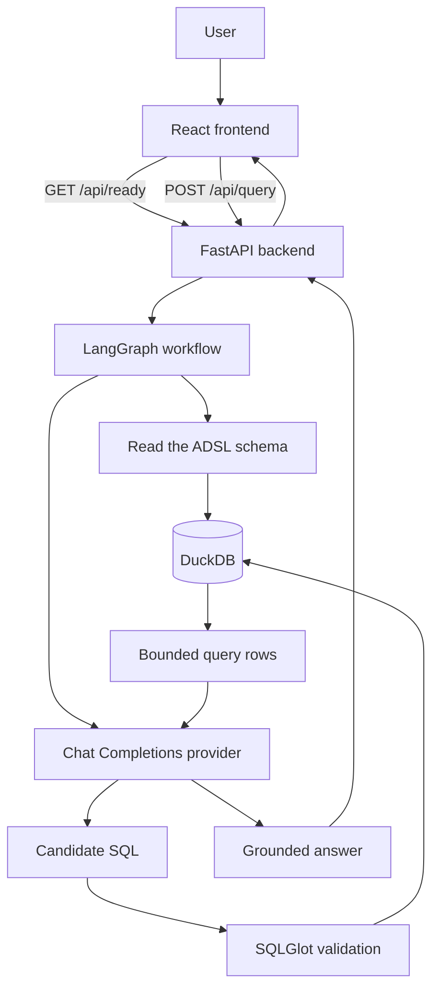

# SeqChat

SeqChat is a local web application for asking natural-language questions about the CDISC pilot ADSL dataset. It returns a grounded answer with the executed SQL and database rows.

## How SeqChat works

```text
React → FastAPI → LangGraph → provider → validated SQL → DuckDB → grounded answer → React
```

LangGraph runs fixed schema retrieval, SQL generation, validation, execution, and answer stages. A failure stops the workflow. SQLGlot permits one read-only query against only `adsl`, DuckDB opens read-only for queries, and returned evidence is limited to 100 rows.

## Technology stack

| Layer | Technology | Responsibility |
|---|---|---|
| Frontend | TypeScript, React, Vite | Collects a question and displays readiness, errors, the grounded answer, SQL, and database evidence |
| API | Python, FastAPI | Validates requests, reports liveness and readiness, invokes the workflow, and returns controlled responses |
| Workflow | LangGraph | Runs the fixed schema, generation, validation, execution, and answer stages |
| Model integration | HTTPX and OpenAI-style Chat Completions | Generates candidate SQL and explains bounded query results |
| SQL validation | SQLGlot | Parses generated SQL and enforces the read-only, `adsl`-only policy |
| Database | DuckDB | Stores and queries the local CDISC pilot ADSL dataset |
| Configuration | pydantic-settings | Loads root `.env`, process-environment overrides, and application defaults |
| Package management | uv and npm | Installs locked backend and frontend dependencies and runs project commands |

## Architecture



The React frontend communicates only with FastAPI. It never receives provider credentials and does not access DuckDB or the model provider directly. On page load it requests readiness so backend connectivity, database initialization, and model configuration remain distinct from query results and query failures.

FastAPI is the application boundary. `/api/health` reports process liveness, `/api/ready` checks local dependencies without consuming a model request, and synchronous `/api/query` runs the complete analytics workflow. Controlled failures contain a stable code, safe message, and workflow stage.

LangGraph preserves five explicit stages:

1. Read the real `adsl` schema from DuckDB.
2. Ask the configured Chat Completions provider for structured candidate SQL.
3. Parse and validate one read-only, `adsl`-only query with SQLGlot.
4. Execute validated SQL against DuckDB in read-only mode with a 100-row limit.
5. Ask the provider to explain only the validated SQL and returned rows.

Any stage failure stops the graph. Structured-output failures cannot reach SQL validation or execution. Deterministic backend code—not the model—controls database access and SQL safety.

## Build and run locally

### Prerequisites

- Python 3.12
- [uv](https://docs.astral.sh/uv/)
- Node.js 20.19 or newer and npm
- Network access for installation, data download, and model requests

Clone the repository if needed:

```text
git clone https://github.com/nekoium/seqchat.git
cd seqchat
```

Run the remaining commands from the repository root unless stated otherwise.

### 1. Install dependencies

These commands are the same in Windows PowerShell, Windows Command Prompt, Linux shells, and macOS shells:

```text
uv sync --directory backend --frozen
npm ci --prefix frontend
```

### 2. Initialize the dataset

```text
uv run --directory backend seqchat-init-data
```

This downloads the pinned CDISC fixture, verifies its checksum, and creates the ignored `data/seqchat.duckdb` with an `adsl` table.

### 3. Create and edit the root `.env`

**Windows PowerShell:**

```powershell
Copy-Item .env.example .env
```

**Windows Command Prompt:**

```bat
copy .env.example .env
```

**Linux and macOS (POSIX shell):**

```sh
cp .env.example .env
```

Enter provider values in `.env`:

```dotenv
SEQCHAT_LLM_BASE_URL=https://provider.example/v1
SEQCHAT_LLM_API_KEY=your-local-secret
SEQCHAT_LLM_MODEL=your-model-id
SEQCHAT_LLM_JSON_MODE=false
```

The backend loads this file from the repository root regardless of the current working directory. Real process environment variables take precedence over root `.env`, which takes precedence over defaults. Keep `.env` local; never use `VITE_*` for provider secrets.

### Chat Completions compatibility contract

SeqChat supports OpenAI-style Chat Completions only; it does not use `/responses`.

- The base URL normally ends in `/v1`.
- The base URL must be an `http` or `https` URL and must **not** include `/chat/completions`.
- SeqChat preserves a legitimate base-path prefix and appends exactly one `/chat/completions`.
- Authentication is `Authorization: Bearer <API key>`.
- Requests use `SEQCHAT_LLM_MODEL` and Chat Completions `messages`.
- Responses must contain nonblank string content at `choices[0].message.content`.
- SQL generation requires a JSON object containing `sql` and `rationale`.
- `SEQCHAT_LLM_JSON_MODE=false` is the compatibility-oriented default. It omits `response_format`, prompts for only JSON, and accepts plain JSON or one narrow Markdown JSON fence.
- Set `SEQCHAT_LLM_JSON_MODE=true` only if the provider supports `response_format: {"type":"json_object"}`. Answer generation never requests JSON mode.

### 4. Start FastAPI

```text
uv run --directory backend uvicorn seqchat.api:app --reload
```

### 5. Check liveness and readiness

Liveness says only that FastAPI is reachable. Readiness separately checks the configured DuckDB file for `adsl` and validates model configuration; it makes no model request.

**Windows PowerShell:**

```powershell
Invoke-RestMethod http://127.0.0.1:8000/api/health
Invoke-RestMethod http://127.0.0.1:8000/api/ready | ConvertTo-Json -Depth 4
```

**Windows Command Prompt, Linux, and macOS:**

```sh
curl http://127.0.0.1:8000/api/health
curl http://127.0.0.1:8000/api/ready
```

`/api/ready` reports stable backend, database, and model component states without returning paths or configuration values. A ready response does **not** prove that the live provider is available or compatible.

### 6. Optionally verify the live provider

```text
uv run --directory backend seqchat-check --help
uv run --directory backend seqchat-check
```

**`seqchat-check` makes a real model request and may incur provider cost.** It checks settings, opens DuckDB read-only and verifies `adsl`, contacts the Chat Completions endpoint, and validates the structured SQL-generation response. It exits `0` only when every check passes. Unlike readiness, a successful check proves the configured provider completed the required structured request at that time.

### 7. Start Vite

Open another terminal at the repository root:

```text
npm run dev --prefix frontend
```

Open <http://localhost:5173>. Vite proxies `/api` to `http://127.0.0.1:8000`. The page displays readiness separately from query results and query failures.

### 8. Submit the golden question

Ask:

> How many subjects are in each planned treatment group?

Expected database evidence is Xanomeline High Dose 84, Xanomeline Low Dose 84, and Placebo 86. Provider wording and generated safe SQL can vary.

## Process-environment overrides

Use an override when needed. It wins over `.env`.

**Windows PowerShell:**

```powershell
$env:SEQCHAT_LLM_MODEL = 'temporary-model'
uv run --directory backend uvicorn seqchat.api:app --reload
```

**Windows Command Prompt:**

```bat
set SEQCHAT_LLM_MODEL=temporary-model
uv run --directory backend uvicorn seqchat.api:app --reload
```

**Linux and macOS:**

```sh
SEQCHAT_LLM_MODEL=temporary-model uv run --directory backend uvicorn seqchat.api:app --reload
```

## Troubleshooting

| Symptom/category | Action |
|---|---|
| Backend unreachable or proxy failure | Start FastAPI on port 8000. Check `/api/health`, then confirm Vite's `/api` proxy target. Empty or HTML proxy responses are shown as safe generic errors. |
| `model_not_configured` | Fill all three nonblank provider values in root `.env`, or set process-environment overrides, then restart FastAPI. |
| `model_configuration_invalid` | Use a plain HTTP(S) base URL, normally ending in `/v1`, with no credentials, query string, fragment, or `/chat/completions`. |
| `database_not_ready` | Run `uv run --directory backend seqchat-init-data`; confirm the process can read the generated file. |
| 401/403 (`provider_auth_error`) | Check the API key, account authorization, model access, and provider permissions. |
| Unsupported `response_format` | Set `SEQCHAT_LLM_JSON_MODE=false` and restart. Enable it only for providers with native JSON-object mode. |
| Timeout or connection failure | Check the provider host, network, proxy/VPN, and provider status. The API distinguishes timeout from connection failure. |
| 429/overload (`provider_overloaded`) | Wait for provider capacity or quota to recover, then submit again. SeqChat does not retry automatically. |
| Malformed/incompatible response | Confirm the provider implements the documented Chat Completions `choices[0].message.content` contract and returns valid structured SQL JSON. |

Server logs include only sanitized categories, upstream status codes, and safe provider request IDs when available. They do not include authorization headers, API keys, URLs with query data, raw provider bodies, or stack traces.

## Verify

```text
uv run --directory backend ruff check .
uv run --directory backend mypy src
uv run --directory backend pytest
npm run lint --prefix frontend
npm run typecheck --prefix frontend
npm run test --prefix frontend
npm run build --prefix frontend
```

Automated tests use HTTPX mock transports and deterministic fake models; they do not contact a real provider.

## Current limitations

- SeqChat supports only the CDISC pilot ADSL dataset and its `adsl` table.
- Each synchronous request contains one question; there is no memory or streaming.
- There is no automatic SQL repair or retry.
- Query evidence is limited to 100 rows.
- There are no charts, authentication, deployment, or frontend provider access.
