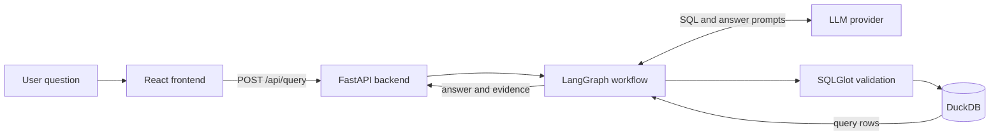
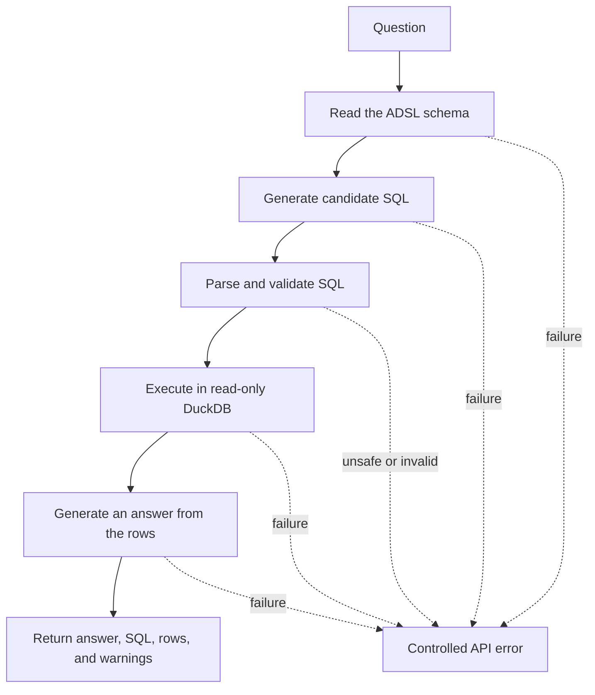

# SeqChat

SeqChat is a local web application for asking natural-language questions about the CDISC pilot ADSL dataset. It returns a grounded answer with the executed SQL and database rows.

## How SeqChat works



The model drafts SQL from the question and real database schema. The backend validates the SQL, executes it against DuckDB, and asks the model to explain only the returned rows.

## Install and run locally

### Prerequisites

- Python 3.12
- [uv](https://docs.astral.sh/uv/)
- Node.js 20.19 or newer
- npm
- Network access for dependency installation, data download, and model calls

### 1. Clone and install

```powershell
git clone https://github.com/nekoium/seqchat.git
cd seqchat
uv sync --directory backend --frozen
npm ci --prefix frontend
```

### 2. Prepare the database

```powershell
uv run --directory backend seqchat-init-data
```

This command downloads a pinned CDISC fixture, verifies its checksum, and creates `data/seqchat.duckdb`. The database contains 254 rows and 48 columns.

### 3. Configure and start the backend

Get compatible provider values from the project maintainer. Set them in the backend terminal, then start FastAPI:

```powershell
$env:SEQCHAT_LLM_BASE_URL = '<provider-base-url>'
$env:SEQCHAT_LLM_API_KEY = '<provider-api-key>'
$env:SEQCHAT_LLM_MODEL = '<provider-model-id>'
uv run --directory backend uvicorn seqchat.api:app --reload
```

Do not prefix these variables with `VITE_`. Do not store real credentials in tracked files. The application does not load `.env` files.

### 4. Start the frontend

Open a second terminal at the repository root:

```powershell
npm run dev --prefix frontend
```

Open <http://localhost:5173>. Vite sends `/api` requests to FastAPI at `http://127.0.0.1:8000`.

## Your first query in SeqChat

1. Open the application in your browser.
2. Enter **How many subjects are in each planned treatment group?**
3. Select **Ask**.
4. Review the grounded answer, executed SQL, and returned rows.

Expected evidence:

- Xanomeline High Dose: 84
- Xanomeline Low Dose: 84
- Placebo: 86

## Technology stack

| Layer | Technology | Role |
|---|---|---|
| Frontend | TypeScript, React, Vite | Displays the query form, answer, SQL, rows, and errors |
| API | Python, FastAPI | Validates requests and connects the frontend to the workflow |
| Workflow | LangGraph | Runs each query through a fixed sequence of stages |
| Model integration | OpenAI-compatible chat API | Drafts SQL and explains query results |
| SQL validation | SQLGlot | Parses SQL and enforces the read-only policy |
| Database | DuckDB | Stores and queries the local ADSL dataset |
| Package management | uv, npm | Installs locked backend and frontend dependencies |

## Architecture



LangGraph runs five stages: schema retrieval, SQL generation, validation, execution, and answer generation. A failure stops the workflow and returns a controlled error.

The model proposes SQL and explains results. Deterministic backend code controls database access:

- DuckDB opens in read-only mode for queries.
- SQLGlot permits one read-only query against the `adsl` table.
- The backend rejects destructive operations, multiple statements, and external tables.
- The backend limits returned evidence to 100 rows.
- The answer prompt contains the validated SQL and actual database rows.

## Verify

```powershell
uv run --directory backend ruff check .
uv run --directory backend mypy src
uv run --directory backend pytest
npm run lint --prefix frontend
npm run typecheck --prefix frontend
npm run test --prefix frontend
npm run build --prefix frontend
```

The automated tests use a deterministic fake model. Run a separate browser check to verify the configured provider.

## Current limitations

- SeqChat supports only the CDISC pilot ADSL dataset and its `adsl` table.
- Each request contains one question. The application has no conversation memory or streaming.
- The workflow has no automatic SQL repair or retry loop.
- Query evidence is limited to 100 rows.
- The application has no charts, authentication, deployment, or production telemetry.
- Answer quality depends on the configured model. Deterministic code enforces SQL safety separately.
